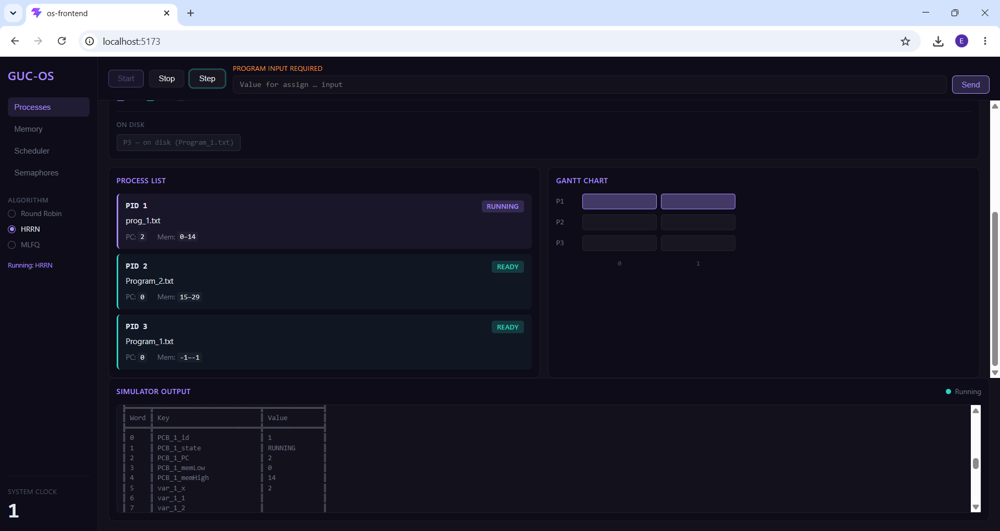
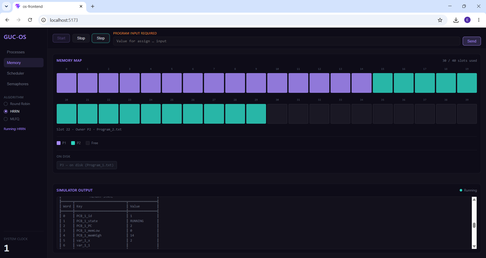
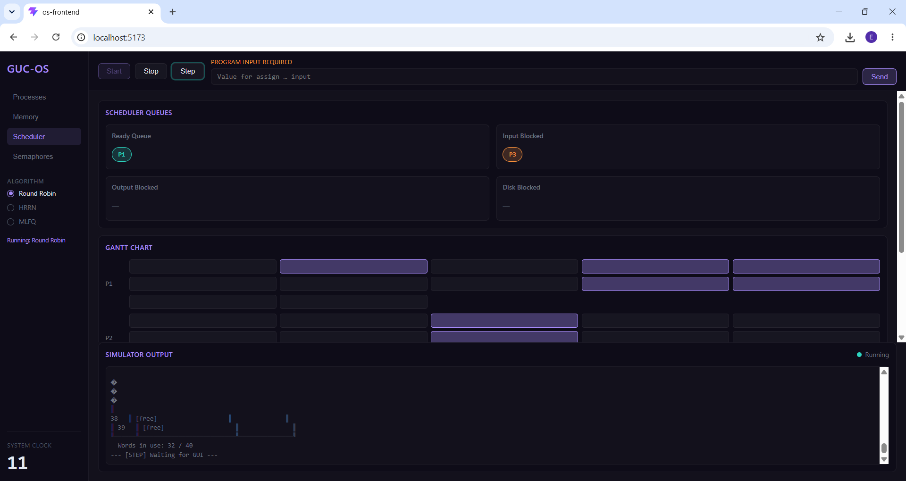
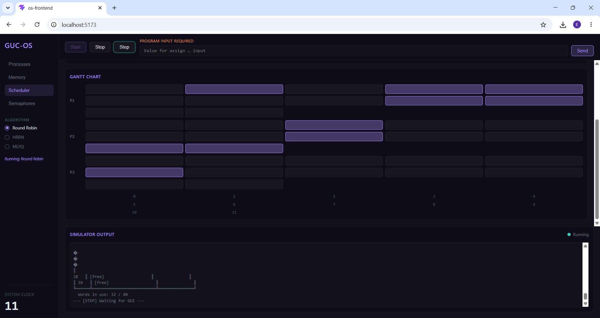
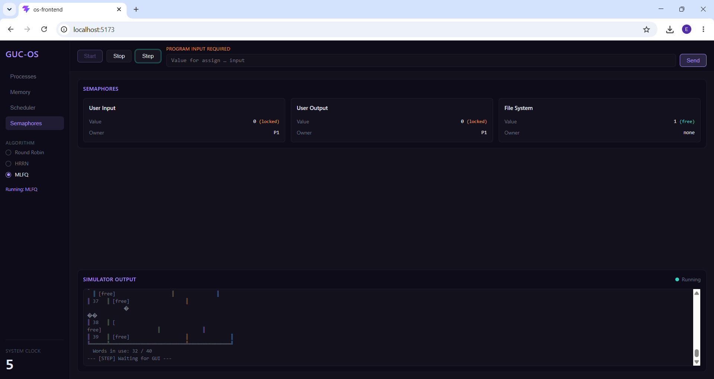

# GUC-OS Simulator

A simulation of a basic operating system built for CSEN 602 - Operating Systems at the
German University in Cairo. The project implements core OS concepts including process
scheduling, memory management, mutual exclusion, and a React-based GUI to visualize
the simulation in real time.

## Features

- **Three scheduling algorithms:** Round Robin (RR), Highest Response Ratio Next (HRRN),
  and Multi-Level Feedback Queue (MLFQ)
- **Simulated 40-word memory** with process allocation, compaction, and disk swapping
- **Three mutexes** for mutual exclusion over userInput, userOutput, and file system resources
- **Step-by-step execution** with clock-cycle-level control via the GUI
- **Live visualization** of memory map, process states, scheduler queues, semaphores,
  and Gantt chart
- **Real-time terminal output** streaming directly from the C executable

## Screenshots

### Process List

*Live view of all processes with their PID, state (Ready / Running / Blocked / Finished),
program counter, and memory boundaries.*

### Memory Map

*Color-coded visualization of all 40 memory words. Each process gets a distinct color.
Processes swapped to disk are shown in the "On Disk" section below the map.*

### Scheduler — Queues

*Real-time view of the Ready Queue and all Blocked Queues (userInput, userOutput, file)
updated after every scheduling event.*

### Scheduler — Gantt Chart

*Gantt chart showing execution history for each process across all clock cycles.
Demonstrates the non-preemptive nature of HRRN with distinct execution blocks.*

### Semaphores

*Live status of all 3 mutexes — value (locked/free) and current owner.
Shows mutual exclusion in action when a process holds a resource.*

## Project Structure

```
OS project/
├── src/                        # C source files (the OS simulation)
│   ├── main.c                  # Entry point, boot sequence, algorithm selection
│   ├── scheduler.c             # RR, HRRN, and MLFQ scheduling algorithms
│   ├── memory.c                # 40-word memory, allocation, swap in/out
│   ├── interpreter.c           # Instruction parser and executor
│   ├── mutex.c                 # Semaphore implementation (semWait/semSignal)
│   ├── pcb.c                   # Process Control Block management
│   ├── queue.c                 # Ready and blocked queue operations
│   ├── syscalls.c              # System call implementations
│   ├── loader.c                # Program file loader
│   └── os-frontend/            # React + Vite frontend
│       ├── src/
│       │   ├── components/     # UI components (MemoryMap, ProcessList, etc.)
│       │   ├── hooks/          # useSimulator hook (polling, state management)
│       │   └── api/            # REST API calls to Node bridge
│       └── dist/               # Production build
├── server/                     # Node.js bridge between frontend and C executable
│   ├── index.js                # Express server with REST endpoints
│   ├── simulator.js            # Spawns and communicates with os_test.exe
│   └── parser.js               # Parses C stdout into structured UI state
├── include/                    # C header files
├── programs/                   # The 3 program text files loaded by the OS
│   ├── Program_1.txt           # printFromTo: prints numbers between two inputs
│   ├── Program_2.txt           # writeFile: writes user input to a file
│   └── Program_3.txt           # readFile: reads and prints a file's contents
└── screenshots/                # UI screenshots for documentation
```

## How It Works

### Architecture
The project has three layers that communicate in sequence:

```
React Frontend (Vite :5173)
        ↕  REST API (/api/*)
Node.js Bridge (Express :3001)
        ↕  stdin/stdout
C Executable (os_test.exe)
```

The C executable runs the actual OS simulation and prints all output to stdout. The
Node.js bridge spawns the executable, reads its output line by line, parses it into
structured state (processes, memory, queues, semaphores, Gantt), and exposes that
state via a REST API. The React frontend polls the API every 400ms to keep the UI live.

### The 3 Programs

**Program 1** — Takes two numbers as input and prints all numbers between them:
```
semWait userInput
assign x input
assign y input
semSignal userInput
semWait userOutput
printFromTo x y
semSignal userOutput
```

**Program 2** — Takes a filename and data as input and writes to a file:
```
semWait userInput
assign a input
assign b input
semSignal userInput
semWait file
writeFile a b
semSignal file
```

**Program 3** — Takes a filename as input and prints its contents:
```
semWait userInput
assign a input
semSignal userInput
semWait file
assign b readFile a
semSignal file
semWait userOutput
print b
semSignal userOutput
```

### Process Arrival Times
- Process 1 arrives at clock **0**
- Process 2 arrives at clock **1**
- Process 3 arrives at clock **4**

### Memory Layout
Each process is allocated a contiguous block of memory words containing:
- 5 PCB fields (processID, state, PC, memLow, memHigh)
- 3 variable slots
- N instruction slots (one per line of the program)

If memory is full when a new process arrives, the OS selects a victim process,
swaps it out to disk, and loads the new process in its place.

## How to Run

### Prerequisites
- **GCC** to compile the C simulation
- **Node.js v18+** for the server bridge and frontend

### Step 1 — Compile the C simulator
```bash
cd "OS project/src"
gcc main.c scheduler.c memory.c interpreter.c mutex.c pcb.c queue.c syscalls.c loader.c -o os_test
```

> On Windows this produces `os_test.exe`. On Linux/macOS it produces `os_test`.
> If on Linux/macOS, open `server/simulator.js` and change `os_test.exe` to `os_test`
> on the `EXE_PATH` line.

### Step 2 — Start the Node.js bridge
```bash
cd "OS project/server"
npm install
node index.js
```
The bridge starts on `http://localhost:3001`. Keep this terminal open.

### Step 3 — Start the React frontend
Open a second terminal:
```bash
cd "OS project/src/os-frontend"
npm install
npm run dev
```
Open `http://localhost:5173` in your browser.

### Step 4 — Run the simulation
1. Select a scheduling algorithm (**Round Robin**, **HRRN**, or **MLFQ**) from the sidebar
2. Click **Start** to launch the simulation
3. When a program requests user input, a text field appears at the top — type a value
   and click **Send**
4. Click **Step** to advance one clock cycle at a time whenever the simulator pauses
5. Switch between **Processes**, **Memory**, **Scheduler**, and **Semaphores** tabs
   to observe the simulation from different perspectives

## Scheduling Algorithms

### Round Robin (RR)
Preemptive. Each process executes **2 instructions** per time slice. If a process does
not finish within its slice it is moved to the back of the Ready Queue.

### Highest Response Ratio Next (HRRN)
Non-preemptive. At every scheduling decision the process with the highest response
ratio is selected. Formula:

```
Response Ratio = (Waiting Time + Burst Time) / Burst Time
```

### Multi-Level Feedback Queue (MLFQ)
Uses 4 priority queues. Processes start in the highest priority queue (quantum = 1).
Each lower level doubles the quantum: `quantum = 2^i` where `i` is the queue level
(0-indexed). If a process uses its full quantum it is demoted to the next level.
The lowest queue uses Round Robin.

## Output Format

The simulator prints the following to the terminal after every clock cycle:
- Current instruction being executed and which process is running
- Full memory state table (all 40 words with key/value)
- Ready Queue and all Blocked Queues
- Process state transitions (READY → RUNNING → BLOCKED → FINISHED)
- Swap in/out events with process ID
- System clock value

## Team

Fares Mostafa
Merna Hossam
Ahmed Zahran
Ahmed Maged

## Course

CSEN 602 — Operating Systems, Spring 2026
German University in Cairo
Dr. Aya Salama
```

